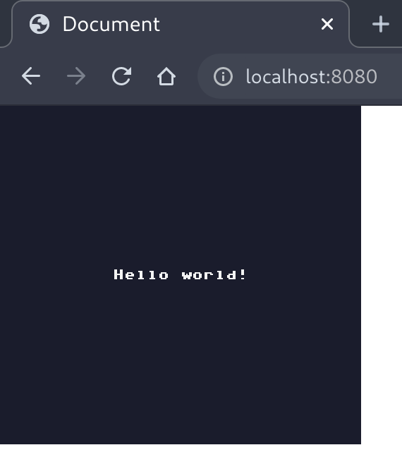

# RES

RES is a minimalist pixel game engine written in [Haxe] where you can controll every pixel diplayed on the screen.

## Motivation

TBD

## Talk is cheap. Show me the code.

The simplest program using RES would look like this:

**Main.hx**:
```haxe
import res.RES;
import res.bios.html5.BIOS;
import res.display.FrameBuffer;
import res.rom.Rom;

function main() {
  RES.boot(new BIOS(), {
    resolution: PIXELS(256, 240),
    rom: Rom.embed('rom'),
    main: (res) -> {
      final font = res.defaultFont;

      return {
        update: (dt:Float) -> {
          // Update your game state here
        },
        render: (fb:FrameBuffer) -> {
          // Render your game here
          fb.clear(res.rom.palette.darkest);
          font.drawPivot(fb, 'Hello world!', 128, 120);
        }
      }
    }
  });
}
```

Assuming the Haxe compiler and the `res` and `res-html5` libraries are installed (more on this in the [Installation](#installation) section), this program can be compiled to JavaScript with the following command:

```bash
haxe -main Main -lib res -lib res-html5 --js main.js
```

Adding the resulting `main.js` file to an empty HTML page will result in the following:



## Getting the Engine

TBD

### Installation

TBD

### License

[MIT](./LICENSE)

[Haxe]: https://haxe.org/